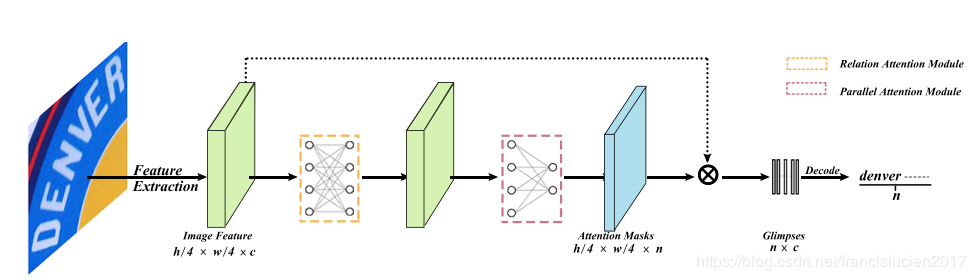
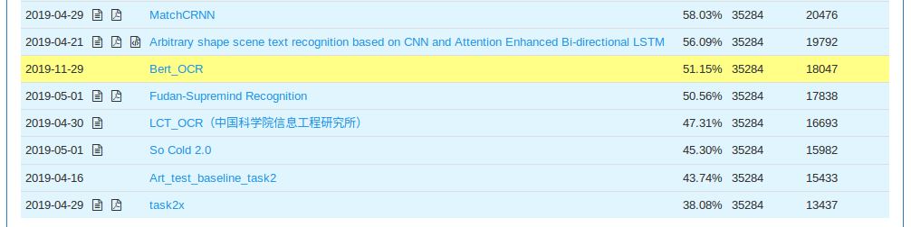

# 2D Attentional Irregular Scene Text Recognizer

Unofficial PyTorch implementation of the [paper](https://arxiv.org/pdf/1906.05708.pdf), which transforms the irregular text with 2D layout to character sequence directly via 2D attentional scheme. They utilize a relation attention module to capture the dependencies of feature maps
and a parallel attention module to decode all characters in
parallel.

At present, the accuracy of the paper cannot be achieved. And i borrowed code from [deep-text-recognition-benchmark](https://github.com/clovaai/deep-text-recognition-benchmark)

**model**
 

**result**
Test on ICDAR2019 with only 51.15%, will continue to improve.


**Feature**
1. Output image string once not like the seqtoseq model

---
## Requirements
Pytorch >= 1.1.0


## Test
1. download the pretrained model [Baidu](https://pan.baidu.com/s/1W1Uhw06kULzpVSl4lAP9zQ) *password:* kdah.

2. test on images which in demo_image folder
```bash
python demo.py --image_folder demo_image --saved_model <model_path/best_accuracy.pth>
```

3. some examples  

| demo images | [Bert_OCR](https://pan.baidu.com/s/1W1Uhw06kULzpVSl4lAP9zQ)  |   
| ---         |     ---      |          --- |  
|     |   available   |    
|       |    shakesshack    |     
|   |   london   |  
|       |    greenstead    | 
|     |   toast   |  
|       |    merry    |  
|     |   underground   |   
|       |    ronaldo    |   
|     |   bally   |  
|       |    university    |   
4. result on benchmark data sets  
| IIIT5k_3000 | SVT | IC03_860 | IC03_867 | IC13_857 | IC13_1015 | IC15_1811 | IC15_2077 | SVTP | CUTE80 |  
| --- | --- | --- | --- | --- | --- | --- | --- | --- | --- |  
| 84.367 | 79.907 | 91.860 | 91.465 | 88.448 | 86.010 | 65.654 | 63.215 | 68.527 |81.185 |

**total_accuracy: 78.423**

---

## Train
1. I prepared a small dataset for train.The image and labels are in `./dataset/BAIDU`.
```bash
python train.py --root ./dataset/BAIDU/images/ --train_csv ./dataset/BAIDU/small_train.txt --val_csv ./dataset/BAIDU/small_train.txt
```

## Reference
1. [deep-text-recognition-benchmark](https://github.com/clovaai/deep-text-recognition-benchmark)
2. [2D Attentional Irregular Scene Text Recognizer](https://arxiv.org/pdf/1906.05708.pdf)
